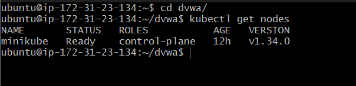
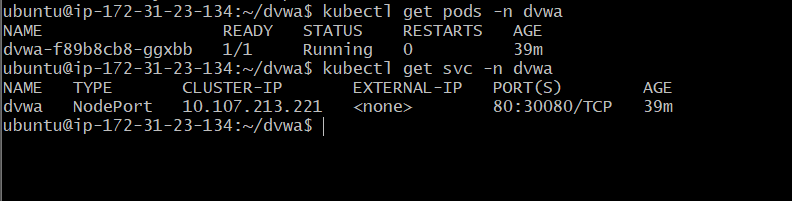
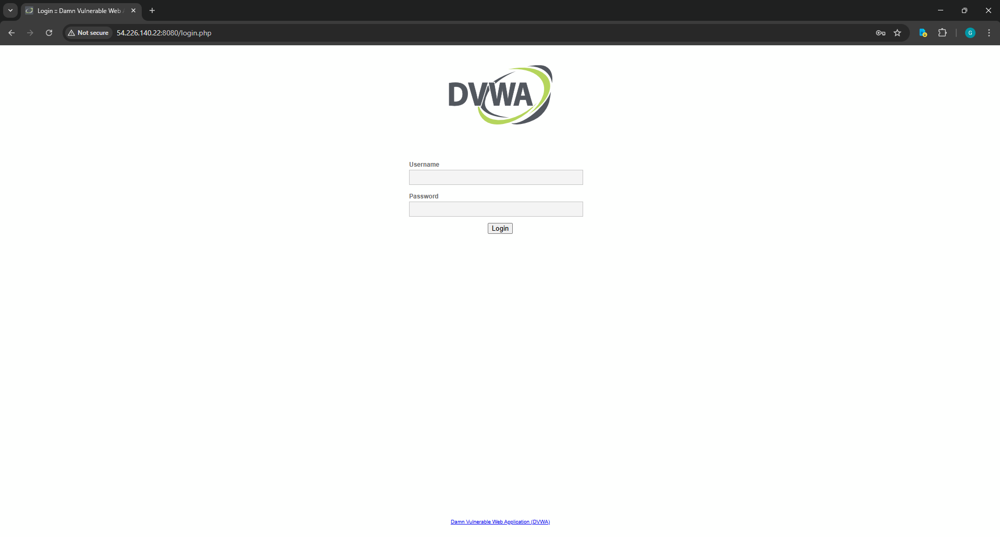
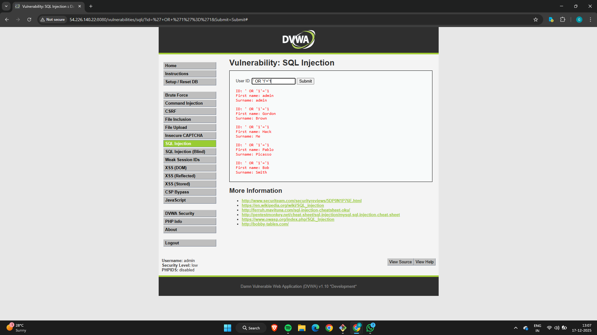
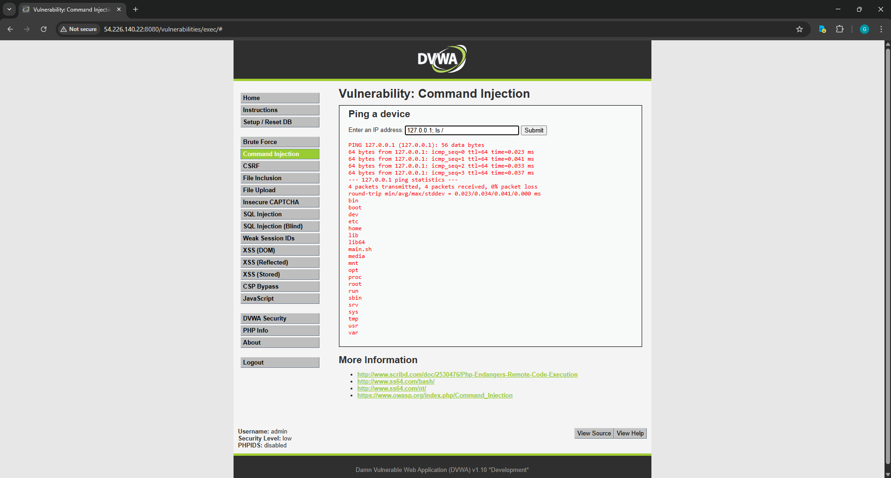
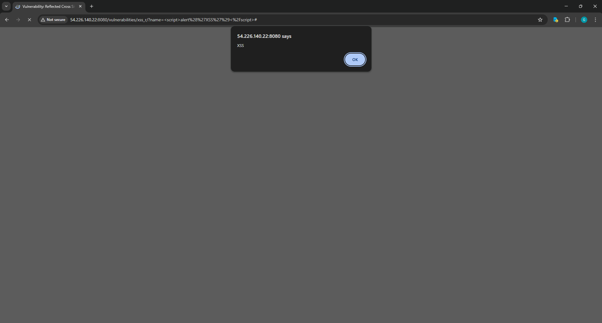

# DVWA on Kubernetes (Minikube)

This repository contains my work on deploying **Damn Vulnerable Web Application (DVWA)** on a local Kubernetes cluster and demonstrating common web application vulnerabilities.
The main goal of this exercise was to understand how vulnerable applications behave in a containerized and Kubernetes-based environment.

> ⚠️ **Note:**
> DVWA is intentionally insecure and is used only for learning and testing. It should never be exposed in real production environments.

---

## 🎯 Objective

* Set up a local Kubernetes cluster using **Minikube**
* Deploy DVWA as a Kubernetes application
* Demonstrate the following attack vectors:

  * SQL Injection
  * Command Injection
  * Cross-Site Scripting (XSS)

---

## 🖥️ Environment Used

* OS: Ubuntu (AWS EC2 instance)
* Container Runtime: Docker
* Kubernetes: Minikube
* Application Image: `vulnerables/web-dvwa`

---

## 📁 Project Structure

```text
.
├── dvwa.yaml
├── dvwa-service.yaml
├── README.md
└── screenshots/
    ├── k8s-nodes.png
    ├── k8s-pods-services.png
    ├── dvwa-login.png
    ├── sql-injection.png
    ├── command-injection.png
    └── xss.png
```

All screenshots related to Kubernetes setup and attack demonstrations are stored in the `screenshots/` directory.

---

## 🚀 Kubernetes Setup

Minikube was started using the Docker driver:

```bash
minikube start --driver=docker
```

Cluster status was verified using:

```bash
kubectl get nodes
```

📸 **Screenshot:** Kubernetes node in `Ready` state


---

## 📦 Deploying DVWA on Kubernetes

### Step 1: Create Namespace

```bash
kubectl create namespace dvwa
```

---

### Step 2: DVWA Deployment

`dvwa.yaml`

```yaml
apiVersion: apps/v1
kind: Deployment
metadata:
  name: dvwa
  namespace: dvwa
spec:
  replicas: 1
  selector:
    matchLabels:
      app: dvwa
  template:
    metadata:
      labels:
        app: dvwa
    spec:
      containers:
      - name: dvwa
        image: vulnerables/web-dvwa
        ports:
        - containerPort: 80
```

Apply the deployment:

```bash
kubectl apply -f dvwa.yaml
```

---

### Step 3: Service Exposure (NodePort)

`dvwa-service.yaml`

```yaml
apiVersion: v1
kind: Service
metadata:
  name: dvwa
  namespace: dvwa
spec:
  type: NodePort
  selector:
    app: dvwa
  ports:
    - port: 80
      nodePort: 30080
```

Apply the service:

```bash
kubectl apply -f dvwa-service.yaml
```

---

### Step 4: Verify Resources

```bash
kubectl get pods -n dvwa
kubectl get svc -n dvwa
```

📸 **Screenshot:** DVWA pod and service status


---

## 🌐 Accessing DVWA

Because Minikube was running on an EC2 instance, port-forwarding was used to access the application:

```bash
kubectl port-forward -n dvwa svc/dvwa 8080:80 --address 0.0.0.0
```

DVWA was then accessed using:

```
http://<EC2_PUBLIC_IP>:8080
```

Login credentials:

```
Username: admin
Password: password
```

📸 **Screenshot:** DVWA login/dashboard


---

## 🔥 Attack Demonstrations

Below are the three attack vectors that were tested on DVWA.

---

### 1️⃣ SQL Injection

**Location:** DVWA → SQL Injection

**Payload used:**

```sql
' OR '1'='1
```

**Observation:**

* The query logic was bypassed
* Multiple user records were returned

📸 Screenshot:


**Explanation:**
User input was not properly validated, allowing injected SQL statements to change the backend query logic.

---

### 2️⃣ Command Injection

**Location:** DVWA → Command Injection

**Payload used:**

```bash
127.0.0.1; whoami
```

**Observation:**

* The command was executed on the server
* The running user was displayed

📸 Screenshot:


**Explanation:**
Input was passed directly to system commands without sanitization, making command execution possible.

---

### 3️⃣ Reflected XSS

**Location:** DVWA → XSS (Reflected)

**Payload used:**

```html
<script>alert('XSS')</script>
```

**Observation:**

* A JavaScript alert popup appeared in the browser

📸 Screenshot:


**Explanation:**
The application reflected user input directly into the response, allowing execution of malicious JavaScript.

---

## 📝 Key Observations

* DVWA works reliably in Kubernetes when deployed as a single pod
* Kubernetes networking behaves differently on Minikube when used on cloud VMs
* Common vulnerabilities can be easily demonstrated in containerized environments
* Proper input validation and secure coding practices are critical

---

## ✅ Conclusion

In this project, DVWA was successfully deployed on a Kubernetes cluster using Minikube.
Three common web application vulnerabilities—**SQL Injection, Command Injection, and Cross-Site Scripting**—were demonstrated successfully.

This exercise helped in understanding both Kubernetes deployment basics and real-world web security issue.
